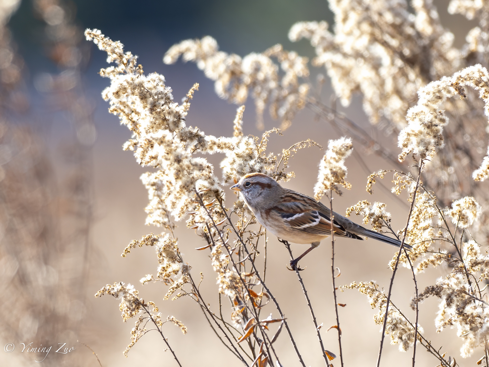
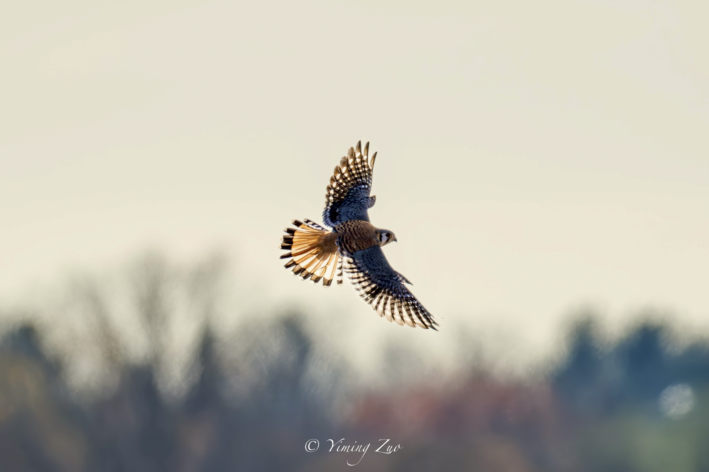

    <b>Dust and Gold, Fur and Bone</b> 
    Baylands Nature Preserve, Palo Alto CA, Summer 2025

    

    <b>Black-necked Stilt: Long Legs at Low Tide</b> 
    Baylands Nature Preserve, Palo Alto CA, Summer 2025

    

    <b>Fierce Hunter in the Current</b> 
    Katmai National Park, AK, Summer 2025

    

    <b>Silent Sentinel</b> 
    Bernal Hill, San Francisco CA, Summer 2025

    

    <b>Gaze of the Woodland King</b> 
    Bernal Hill, San Francisco CA, Summer 2025

    

    <b>Crested Watcher on a Weathered Post</b> 
    Point Reyes National Seashore, CA, Spring 2025

    

    <b>Forster’s Tern: A Whisper Above the Blue</b> 
    Baylands Nature Preserve, Palo Alto CA, Spring 2025

    

    <b>The Rhythm of the Flock</b> 
    Baylands Nature Preserve, Palo Alto CA, Spring 2025

    

<!-- 

    <b>A Moment Between Migrations</b> 
    Coyote Hills, Fremont CA, Spring 2025

    

 -->

<!-- 

    <b>Dashing Roadrunner</b> 
    Sabino Canyon, Tucson AZ, Winter 2024

    

 -->

    <b>Gambel's Quail in Desert Stroll</b> 
    Desert Botanical Garden, Phoenix AZ, Winter 2024

    

    <b>American Tree Sparrow on a Golden Perch</b> 
    Pole Farm, Princeton NJ, Winter 2024

    

    <b>American Kestrel at The Sunset</b> 
    Pole Farm, Princeton NJ, Winter 2024

    

    <b>Kinglet's Quick Strike</b> 
    Pole Farm, Princeton NJ, Fall 2024

    

    <b>Palm Warbler Among Autumn Berries</b> 
    Lake Carnegie, Princeton NJ, Fall 2024

    

    <b>Soaring Through The Autumn Sky</b> 
    Lake Carnegie, Princeton NJ, Fall 2024

    

<!-- 

    <b>Watchful Yellow-Rumped Warbler</b> 
    Lake Carnegie, Princeton NJ, Fall 2024

    

 -->

    <b>Northern Parula Amid Turning Leaves</b> 
    Rogers Wildlife Refuge, Princeton NJ, Fall 2024

    

    <b>Atlantic Puffin Taking Off with a Catch</b> 
    Eastern Egg Rock, Boothbay Harbor ME, Summer 2024

    

